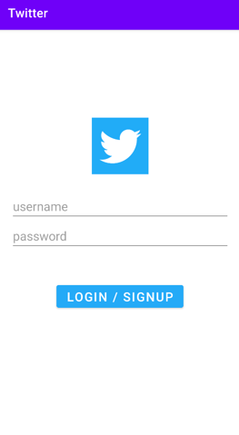
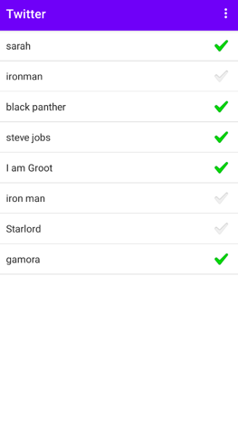
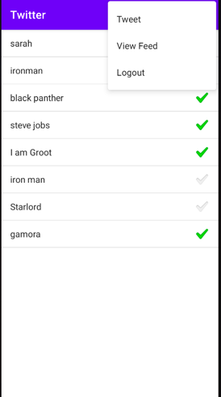
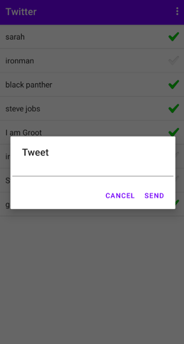

# Twitter

Twitter clone app with the Basic feature developed using Java and using AWS - bitnami parse server
1. Login/signup

2. View all the available users (followers)
   

3. Able to check and uncheck the followers to follow them
   

4. Ability to View the followers feed, Tweet a post and logout

